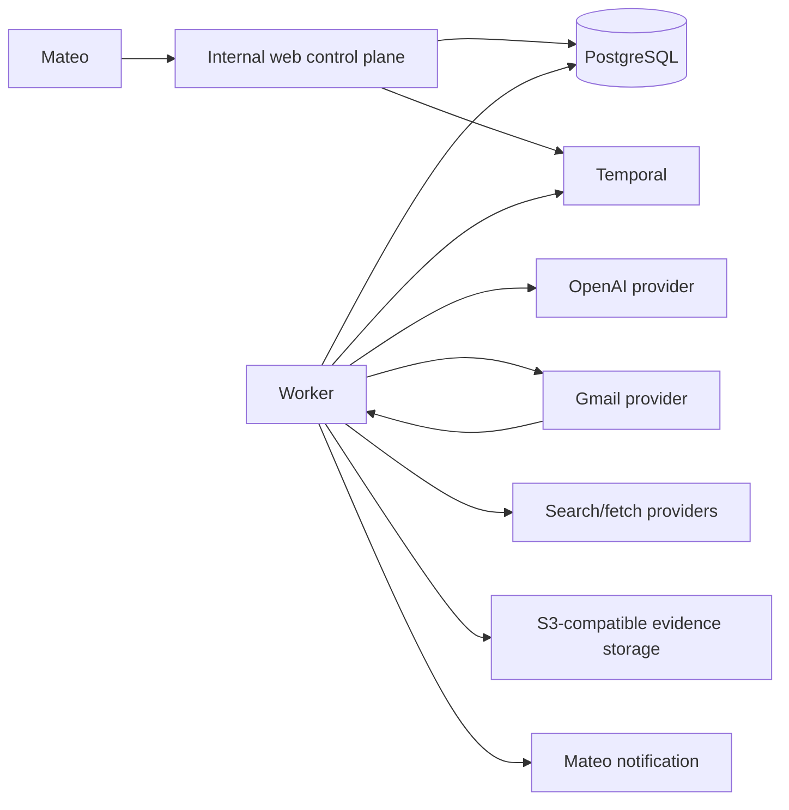

# System context

```mermaid
flowchart LR
  Mateo["Mateo"] --> Web["Internal web control plane"]
  Web --> DB[("PostgreSQL")]
  Web --> Temporal["Temporal"]
  Worker["Worker"] --> Temporal
  Worker --> DB
  Worker --> OpenAI["OpenAI provider"]
  Worker --> Gmail["Gmail provider"]
  Worker --> Search["Search/fetch providers"]
  Worker --> Storage["S3-compatible evidence storage"]
  Gmail --> Worker
  Worker --> Notify["Mateo notification"]
```

The application owns policy and state. Providers are replaceable adapters. All external content is untrusted.
