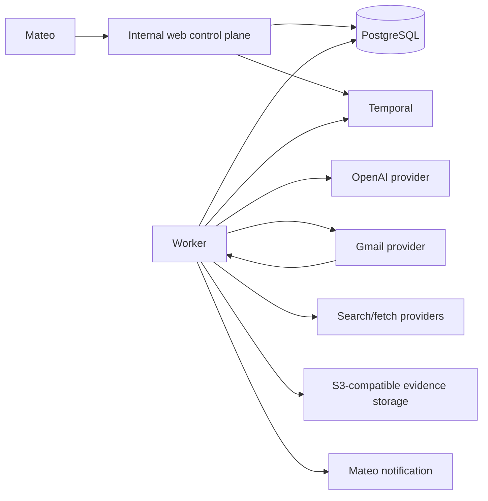

# System context

The application owns policy and state. Providers are replaceable adapters. All external content is untrusted.

## Research boundary

Search providers implement a shared port and return normalized candidates. Secure fetch independently validates DNS, pins a public address for the connection, revalidates redirects, respects robots rules, bounds response size and duration, and converts accepted public documents to inert text.

The database preserves source snapshots, hashes, evidence links, agent-run inputs/outputs, and append-only score decisions. Model output is never the final authority: entity merging requires a deterministic confidence gate, deduplication uses canonical keys, and the ICP scorer recomputes totals and actions from the fixed rubric.

## Contact boundary

Contact extraction consumes only stored inert snapshots. Published addresses and direct routes keep their source document and active evidence IDs. PostgreSQL rejects a contact when the cited evidence, source document, founder, and organization do not form a valid association.

Email validation is layered: syntax, MX availability, and an optional replaceable mailbox-verification provider are separate facts. MX never implies that a mailbox exists. Every verification is append-only, while the contact row stores only the current materialized status.
